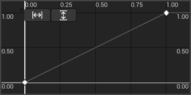
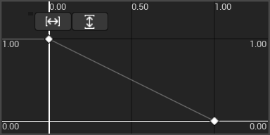
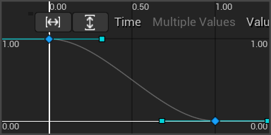
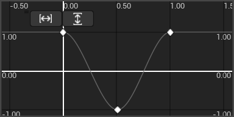
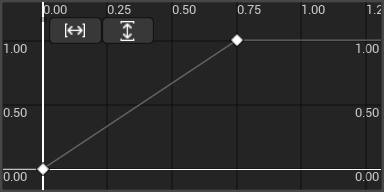

# ToolArcade Turntable
## What is it?

<video controls autoplay muted loop playsinline width="600">
  <source src="Media/TurntableDemoMap.mp4" type="video/mp4">
  Your browser does not support the video tag.
</video>

The Turntable component rotates actors in the Editor viewport, as if on a turntable, even while you work with it.

This can be useful for visualizing how an object looks from all angles without moving the viewport camera, e.g. when setting up asset galleries or zoos, or content that's hostile to depth perception such as wireframes, PCG debug geometry, or special render buffers.

The turntable is an editor-only tool, and has no effect in Play-in-Editor or in shipping games.

## How do I use it?
Add the Turntable component to an actor.  The turntable will start automatically and can be paused, resumed, and stopped using buttons in the Details view.

<video controls autoplay muted loop playsinline width="600">
  <source src="Media/TurntableLiveDemo.mp4" type="video/mp4">
  Your browser does not support the video tag.
</video>

You can configure the rotation using the component's options:
* **Period**: using the default revolution curve, this is the duration of a single revolution, or the time over which the revolution curve is evaluated.  If negative, the turntable will rotate in the opposite direction.
* **Revolution Curve**: controls the revolution's extremes and speed.
  * The time axis is the duration through the configured period: 0.0 = start of period, 1.0 = end of period.
  * The value axis is the amount and direction of rotation at a moment in time.  For example,
    * Value 0.0 = original rotation (0 degrees)
    * Value 1.0 = one revolution (360 degrees)
    * Value -0.5 = one half revolution in reverse (-180 degrees)
  * Adjust the curve's shape to achieve different turntable behaviors, or use the provided presets.

## Configuration tips

You can edit the revolution curve directly in the Details view, or double-click the curve graph to open a separate editing window.

| To achieve this effect...                          | ...as shown here |
|----------------------------------------------------|--|
| Single constant-speed revolution                   |  |
| Single constant-speed anti-revolution              |  |
| Slow turn around the front, faster around the back |  |
| Wibble-wobble                                      |  |
| Revolution with a pause at the end                 |  |